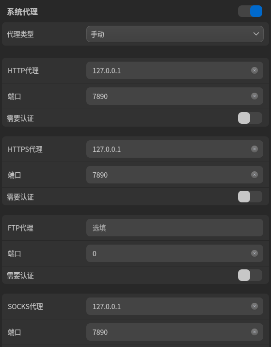

### linux 配置 clash

首先去[clash](https://github.com/doreamon-design/clash/releases)下载与自己系统架构符合的安装包

- 安装

``` shell
gzip -d clash_2.0.24_linux_amd64.tar.gz
mv clash_2.0.24_linux_amd64 /usr/local/bin/clash
sudo ln -s /usr/local/bin/clash/clash /usr/bin/clash  #配置环境变量
export PATH=$PATH:/usr/local/bin #在~/.bashrc中添加
clash -v #查看是否安装成功
```

- 配置文件

``` shell
clash #启动clash 生成~/.config/clash/config.yaml文件
cd ~/.config/clash #进入配置目录
wget --no-check-certificate -O config.yaml 订阅地址 #配置订阅链接
echo -e "export http_proxy=http://127.0.0.1:7890\nexport https_proxy=http://127.0.0.1:7890" >> ~/.bashrc # 配置环境变量
```

- 错误解决

``` shell
INFO[0000] Can't find config, create a initial config file 
INFO[0000] Can't find MMDB, start download              
FATA[0030] Initial configuration directory error: can't initial MMDB: can't download MMDB: Get "https://cdn.jsdelivr.net/gh/Dreamacro/maxmind-geoip@release/Country.mmdb": dial tcp 104.16.86.20:443: i/o timeout 
```

``` shell
下载Country.mmdb超时，可以下载附件放到~/.config/clash/下
```

- 修改系统代理

  配置如图

  

  - 错误解决

    ```shell
    FATA[0000] Parse config error: yaml: unmarshal errors:   line 1: cannot unmarshal !!str `c3M6Ly9...` into config.RawConfig
    由于订阅链接是JMS链接格式，而不是clash格式，直接放入无法使用，可使用https://acl4ssr-sub.github.io/进行转换或者下载客户端进行转换https://github.com/tindy2013/subconverter/releases
    订阅短链放入其中
    ```

- clash客户端

  ``` shell
  ./cfw #运行clash for Windows
  ```

  
